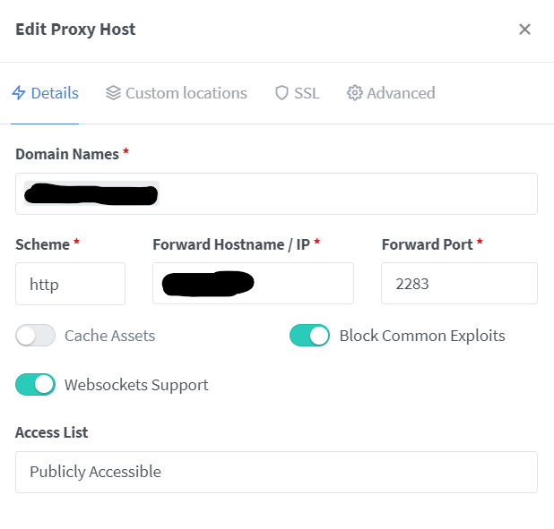

Sometimes Immich may return error 500 after startup. It helps to stop all containers and then start them in that order:
1. immich_postgres, immich_redis, immich_typesense
2. Here you need to wait 3-5 minutes to be sure, that typesense is running correctly
3. Rest of the containers, including immich_server

NGINX Reverse Proxy not
After 1.94 you must enable Websockets Support in the proxy host settings, as they now are used to check the server status from the frontend.

